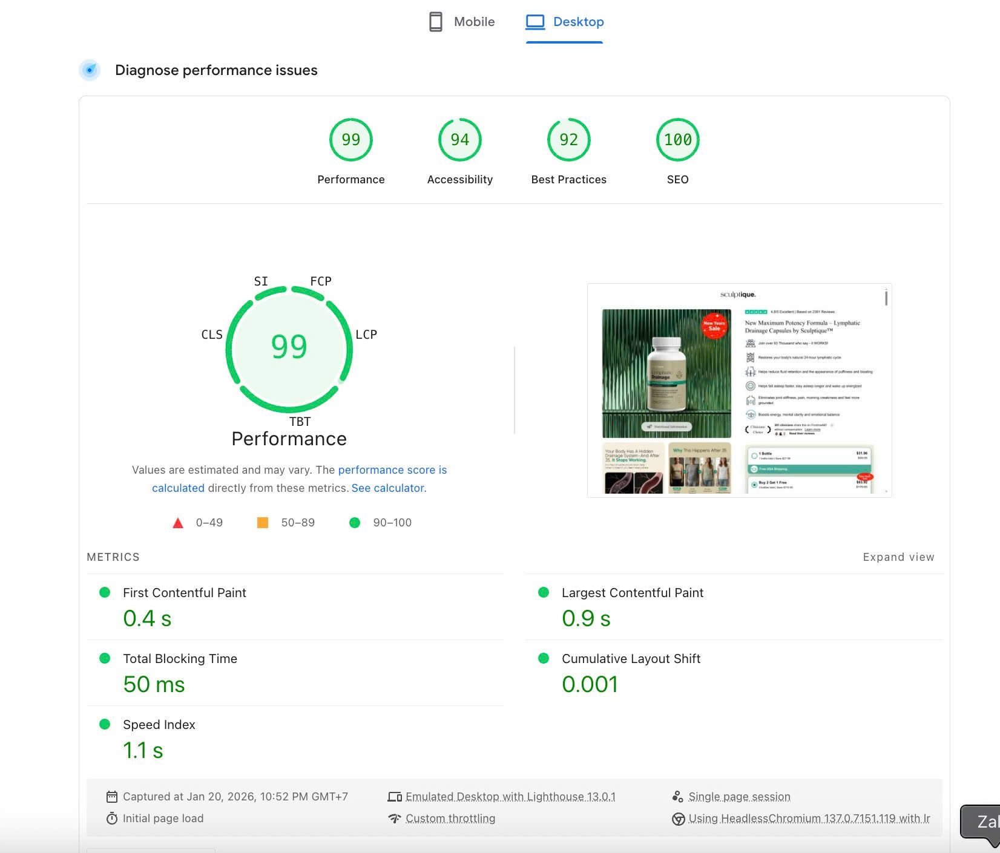
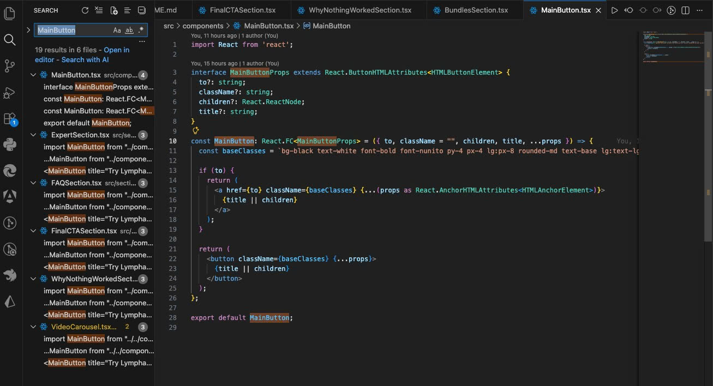
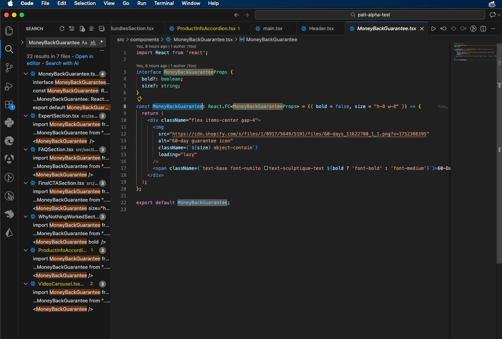

# PATI Alpha Track - eCommerce Developer Practical Test

## Project Overview

This repository contains the practical assessment submission for the **Alpha - eCommerce Developer Track** at PATI Group. The goal of this project is to build a pixel-perfect, responsive clone of the [Sculptique Landing Page](https://trysculptique.com/products/lymph-cc-select), demonstrating high-fidelity UI execution and engineering best practices.

**Developer:** Tran Quoc Nghi

**Live Demo:** [View Deployed Project](https://pati-alpha-test.vercel.app/)

## Tech Stack

This project is built using modern front-end technologies to ensure performance, maintainability, and responsiveness:

-   **React** (v19): Component-based UI architecture.
-   **TypeScript**: For type safety and better developer experience.
-   **Tailwind CSS**: Utility-first CSS framework for precise styling and responsive design.
-   **Vite**: High-performance frontend tooling for instant server start and lightning-fast HMR.
-   **HTML5 & CSS3**: Modern semantic structure and styling standards.

## Key Features

-   **Responsive Design**: Fully optimized layout devices.
-   **Interactive Components**: Functional sliders/carousels and hover states.
-   **Clean Architecture**: Modular component structure and organized file system.

## Performance & Optimization

High performance and SEO optimization were key priorities during development.



-   **High Lighthouse Scores**: Achieved 100/100 SEO and excellent Performance scores.
-   **SEO Configuration**:
    -   Added comprehensive Meta Tags (Title, Description) for search visibility.
    -   Configured [Open Graph](https://ogp.me/) and Twitter Card tags for social media sharing.
    -   Valid `robots.txt` and `sitemap.xml` generated.
    -   Custom Favicon implementation.
-   **Asset Optimization**: Localized critical assets for faster loading times.

## Component Architecture

The project utilizes a modular component architecture to ensure reusability and maintainability.

### Core Reusable Components

-   **`MainButton`**: A highly flexible button component that supports polymorphism (renders as `<button>` or `<a>`), handle varying styles, and ensures consistent CTAs across the site.
-   **`MoneyBackGuarantee`**: A stateless component encapsulating the "60-Day Guarantee" badge logic, allowing for consistent trust signaling in the Hero, CTA, and Bundle sections.

### Code Structure Preview

Screenshots demonstrating the clean code practices and component usage:




## Getting Started

Follow these instructions to set up and run the project locally.

### Prerequisites

Ensure you have **Node.js** installed on your machine.

### Installation

This project uses **Yarn** as the package manager.

1.  **Clone the repository:**
    ```bash
    git clone https://github.com/SoUni2003/pati-alpha-test.git
    cd pati-alpha-test
    ```

2.  **Install dependencies:**
    ```bash
    yarn install
    ```

### Running the Application

To start the development server:

```bash
yarn dev
```

The application will be available at `http://localhost:5173` (or the port shown in your terminal).

### Building for Production

To create a production-ready build:

```bash
yarn build
```

To preview the production build locally:

```bash
yarn preview
```

---

*Thank you for reviewing my submission. I look forward to your feedback!*
